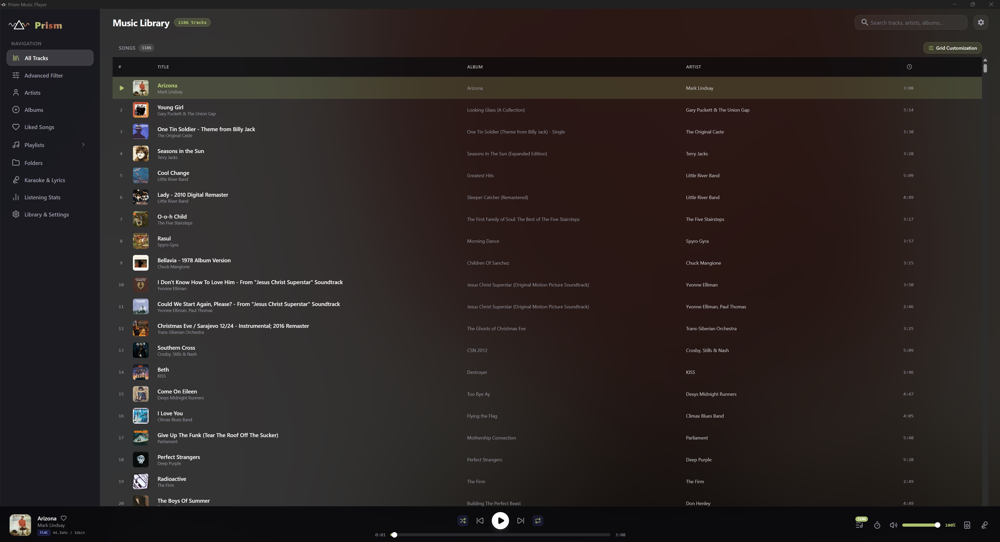
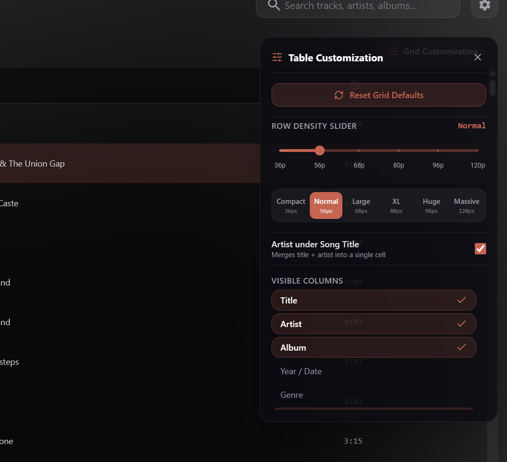
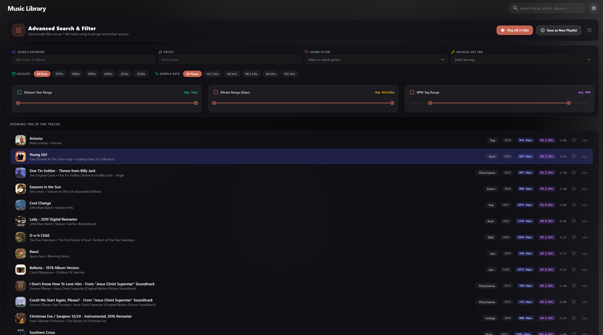
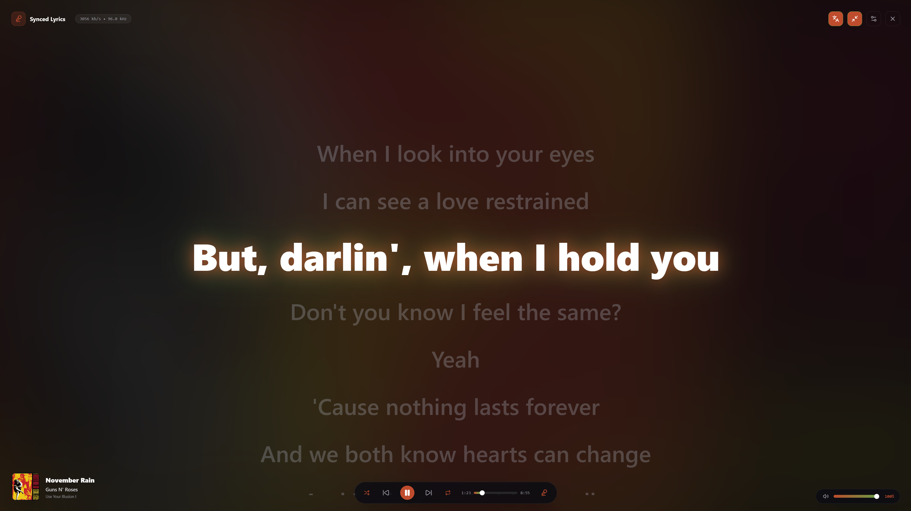
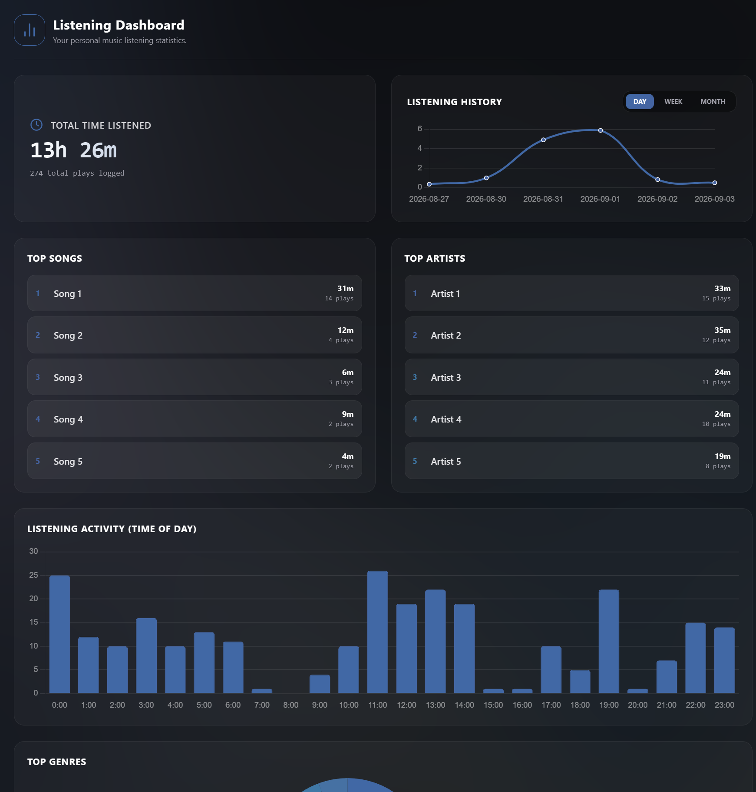
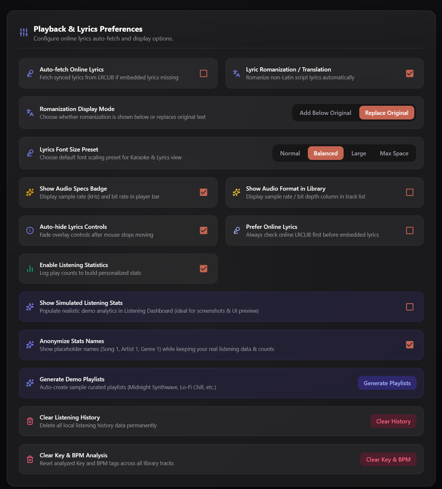

# Prism Music Player

<div align="center">

[](https://www.rust-lang.org/)
[](https://tauri.app/)
[](https://react.dev/)
[](https://www.typescriptlang.org/)
[](#system-requirements)

**A fast, local music player and audio workstation built with Tauri v2, Rust, and React 19.**

*Bit-Perfect Direct Hardware Output • Gapless Playback • EBU R128 ReplayGain • Syllable Lyrics & Discovery Cascade • Song Linking • Virtualized Performance Engine*

</div>

---

## Table of Contents

- [Overview](#overview)
- [Interface Showcase & Screenshots](#interface-showcase--screenshots)
- [System Architecture & Backend Pipeline](#system-architecture--backend-pipeline)
  - [Native Audio Engine (WASAPI, CPAL & Gapless Audio)](#1-native-audio-engine-wasapi-cpal--gapless-audio)
  - [EBU R128 ReplayGain & Loudness Normalization](#2-ebu-r128-replaygain--loudness-normalization)
  - [DSP Audio Analysis Engine (BPM & Key Detection)](#3-dsp-audio-analysis-engine-bpm--key-detection)
  - [Metadata Extraction & Direct Tag Embedding](#4-metadata-extraction--direct-tag-embedding)
  - [Lyrics Engine, Syllable Sync & Multi-Provider Cascade](#5-lyrics-engine-syllable-sync--multi-provider-cascade)
  - [Song Linking & Linked Suites](#6-song-linking--linked-suites)
  - [Local Telemetry & Listening Analytics](#7-local-telemetry--listening-analytics)
- [Core Features](#core-features)
- [Audio & DSP Technical Specifications](#audio--dsp-technical-specifications)
- [Tech Stack](#tech-stack)
- [Directory Structure](#directory-structure)
- [Getting Started](#getting-started)
  - [Prerequisites](#prerequisites)
  - [Installation & Local Development](#installation--local-development)
- [Building & Packaging](#building--packaging)
  - [Windows Standalone Production Executable](#windows-standalone-production-executable)
  - [Cross-Platform Tauri Bundles](#cross-platform-tauri-bundles)
- [Configuration & Keybindings](#configuration--keybindings)
- [Changelog & Releases](#changelog--releases)

---

## Overview

**Prism Music Player** is a local desktop audio player and library manager built with a **Rust audio engine** and a **React 19 interface** powered by Tauri v2:

1. **Bit-Perfect Audio Output & Gapless Transitions:** Matches source track sample rates and bit depths directly with output DACs up to 192 kHz without OS mixer resampling, supporting true gapless track transitions.
2. **Built-in EBU R128 ReplayGain Scanner:** High-performance background audio loudness scanner and real-time gain normalizer supporting embedded track/album gain tags as well as SQLite database persistence.
3. **Song Linking & Linked Suites:** Connect multi-part tracks, concept albums, and continuous movements so they always play together in sequence with drag-and-drop reordering.
4. **5-Tier Lyrics Discovery & Immersive View:** Automatic lyrics discovery waterfall (Unison, NetEase, LRCLIB, SyncLRC), full-height split immersive lyrics view, customizable animated backgrounds, syllable-level karaoke sync, and in-track lyrics search.
5. **Multi-Track Selection & Batch Actions:** Shift/Ctrl multi-selection, bulk queueing, and multi-song drag-and-drop directly into playlists.
6. **Waveform DSP Analysis:** Analyzes raw audio across CPU cores using `stratum-dsp`, `rustfft`, and `rubato` resampling to estimate musical keys and tempo (BPM).
7. **Virtualized Performance Grid:** Custom data grid (`@revolist/react-datagrid`) with native Stencil metadata cell renderers that handles 50,000+ tracks smoothly with near-zero latency.
8. **Dynamic Theming & Windows Taskbar Controls:** Dynamically adapts search inputs, borders, and accents to album art colors, with Windows Taskbar thumbnail playback controls.

---

## Interface Showcase & Screenshots

### 1. Main Music Library View
*Virtualized data table showing audio format badges (`FLAC 44.1kHz / 16bit`) and color accents sampled from album artwork.*



---

### 2. Table & Grid Customization
*Customize your layout: drag to reorder columns, drag borders to adjust column widths, select from 6 row height presets (36px to 120px), and toggle column visibility.*



---

### 3. Advanced Parametric Search & Filter
*Filter your library by keyword, artist, genre, musical key, decade, sample rate, release year, bitrate, and BPM. Includes one-click options to play all matches or save them as a playlist.*



---

### 4. Fullscreen Synchronized Karaoke Lyrics
*Fullscreen lyrics viewer with syllable-level highlighting, 8 animation styles, dynamic font scaling, 2-phase instrumental interludes (notes and countdown), live translations, and pronunciation guides for Japanese, Korean, and Chinese.*



---

### 5. Local Listening Statistics & Analytics Dashboard
*Local analytics stored in SQLite. Graphs listening time, daily activity patterns, and top songs, artists, and genres. Includes an anonymization toggle to hide names when sharing screenshots.*



---

### 6. Playback & Lyrics Preferences
*Settings for batch lyrics search and tag embedding, font choices, romanization and translation display modes, wavy seekbar toggle, and audio format badges.*



---

## System Architecture & Backend Pipeline

Prism employs a strict separation of concerns between its low-latency native backend (Rust) and reactive frontend (TypeScript / React 19), communicating over Tauri's binary-accelerated IPC bridge.

```
┌──────────────────────────────────────────────────────────────────────────────────┐
│                             REACT 19 FRONTEND                                    │
│  ┌────────────────────┐  ┌───────────────────────┐  ┌─────────────────────────┐  │
│  │  RevoGrid Table    │  │  Zustand Store        │  │  Adaptive Canvas Color  │  │
│  │  (Native Stencil)  │  │  (Playback/Queue/Lib) │  │  (Theme Stops & Contrast│  │
│  └─────────┬──────────┘  └───────────┬───────────┘  └────────────┬────────────┘  │
└────────────┼─────────────────────────┼───────────────────────────┼───────────────┘
             │ Tauri IPC Invokes       │ Atomic IPC & Events       │
             ▼                         ▼                           ▼
┌──────────────────────────────────────────────────────────────────────────────────┐
│                               TAURI V2 BRIDGE                                    │
│  - System Media Transport Controls (souvlaki / Windows Taskbar Toolbar)          │
│  - Modular Command Router (playback, library, filter, loudness, media, analysis)  │
│  - Lock-Free Atomic Playback Position Bus                                        │
└──────────────────────────────────────┬───────────────────────────────────────────┘
                                       │
┌──────────────────────────────────────┴───────────────────────────────────────────┐
│                              RUST NATIVE CORE                                    │
│                                                                                  │
│   ┌────────────────────────────────┐       ┌──────────────────────────────────┐  │
│   │     GlobalAudioEngine          │       │      Parallel Metadata Scan      │  │
│   │  - Symphonia Decoders          │       │   - Rayon Multithreading         │  │
│   │  - Crossbeam Bounded RingBuf   │       │   - Lofty / Metaflac Tag Parser  │  │
│   │  - Gapless Audio Engine        │       │   - MD5 Path Hash & Lazy Art     │  │
│   │  - CPAL Hardware Stream        │       └────────────────┬─────────────────┘  │
│   └───────────────┬────────────────┘                        │                    │
│                   │                                         ▼                    │
│                   │                        ┌──────────────────────────────────┐  │
│                   │                        │   EBU R128 Scanner & Analysis    │  │
│                   │                        │   - ITU-R BS.1770 Loudness Calc  │  │
│                   │                        │   - Rubato SincFixedIn Resampler │  │
│                   │                        │   - Stratum-DSP & RustFFT BPM/Key│  │
│                   │                        └────────────────┬─────────────────┘  │
│                   ▼                                         ▼                    │
│   ┌────────────────────────────────┐       ┌──────────────────────────────────┐  │
│   │    DAC / Audio Hardware        │       │   SQLite Database                │  │
│   │  (WASAPI / DirectStream / ALSA)│       │  - Listening Stats & History     │  │
│   │                                │       │  - Non-embedded ReplayGain Store │  │
│   └────────────────────────────────┘       └──────────────────────────────────┘  │
└──────────────────────────────────────────────────────────────────────────────────┘
```

### 1. Native Audio Engine (WASAPI, CPAL & Gapless Audio)

Audio playback does **not** use browser `<audio>` elements or Web Audio API. Instead, Prism implements an autonomous, thread-isolated audio streaming engine located in `src-tauri/src/audio.rs`:

- **Dedicated Streaming Thread:** The playback loop executes on an isolated OS thread (`run_audio_thread`), completely decoupled from UI rendering cycles and garbage collection pauses.
- **Universal Codec Decoding via Symphonia:** Pure-Rust format demuxers and decoders handle FLAC, MP3, AAC, ALAC, Vorbis, Opus, WAV, and AIFF files without external DLL dependencies.
- **Bit-Perfect Hardware Negotiation:** 
  1. Inspects the source file's native sample rate (e.g., 44.1 kHz, 88.2 kHz, 96 kHz, 176.4 kHz, 192 kHz) and bit depth.
  2. Queries the selected audio device's supported stream configurations through `cpal`.
  3. If the audio device natively supports the source track's sample rate, Prism initializes a bit-exact stream directly at that frequency, bypassing OS mixer resampling.
  4. If the hardware requires a fixed clock (e.g., 48 kHz), an internal linear interpolation resampler transparently adapts the PCM stream with zero phase distortion.
- **Gapless Audio Playback:** Supports true gapless track boundaries and non-blocking background track preloading for seamless transitions between songs.
- **Lock-Free Atomic Position IPC:** Playback position querying and seek updates communicate via lock-free atomic shared state, eliminating backend mutex lock contention and frontend UI jank.
- **Lock-Free Bounded Ring Buffer:** Audio samples pass from the decoder into the output stream using `crossbeam-channel::bounded` with instant stall detection.
- **Dynamic Stream Migration & Hot-Plugging:** Prism constantly monitors the active audio endpoint. If a user unplugs headphones, switches default devices, or selects a new output in the UI, the engine migrates the WASAPI stream on-the-fly without losing playback position.
- **Output Device Inspector:** An audio endpoint modal shows channels, format, and supported sample rates, with cached device switching.

### 2. EBU R128 ReplayGain & Loudness Normalization

Located in `src-tauri/src/loudness.rs` and `src-tauri/src/commands/loudness.rs`:

- **Built-in ITU-R BS.1770 / EBU R128 Scanner:** Computes integrated loudness (LUFS) and true peak levels across your library in background threads.
- **Real-Time Dynamic Gain Scaling:** Applies track and album ReplayGain adjustments in real time via $10^{\frac{\text{dB}}{20}} \times \text{Volume}$ with hard clipping limits $[-1.0, 1.0]$.
- **Hybrid Metadata Persistence:** Reads embedded `REPLAYGAIN_TRACK_GAIN` / `REPLAYGAIN_ALBUM_GAIN` tags and automatically saves scanner results to local SQLite storage for tracks without embedded tags.

### 3. DSP Audio Analysis Engine (BPM & Key Detection)

Located in `src-tauri/src/commands/analysis.rs` and `src-tauri/src/audio_analysis.rs`:

- **Purpose & Future Dynamic Playlists:** Key and BPM detection facilitates dynamic playlist generation and harmonic mixing.
- **Turbo Drop Sampling:** Skips the initial 45 seconds of a track to bypass atmospheric intros, extracting a high-energy 15-second mono PCM slice.
- **Anti-Aliased Sinc Resampling (Rubato):** High-sample-rate audio (>48 kHz) is downsampled to 44.1 kHz via `rubato::SincFixedIn` using a 128-sample Blackman-Harris window and 256 oversampling factor to eliminate Nyquist aliasing.
- **Fast Fourier Transform & Harmonic Analysis:** Analyzes the waveform using `stratum-dsp` and `rustfft` to compute rhythmic onset periodicity (BPM) and tonal chromagram centroids (Musical Key).
- **Parallel CPU Batching:** Scans tracks in parallel across CPU cores using Rayon with live progress updates.
- **Incremental Library Refresh:** Detects new and modified files during scans while retaining missing songs for 24 hours to prevent accidental playlist removal during storage disconnects.

### 4. Metadata Extraction & Direct Tag Embedding

Located in `src-tauri/src/metadata.rs` and `src-tauri/src/commands/library.rs`:

- **Dual-Layer Tag Extraction:** Leverages `metaflac` for native FLAC Vorbis comments and `lofty` as a fallback for ID3v1, ID3v2, MP4/M4A atoms, and OGG containers.
- **Direct-to-Disk Lyrics Embedding:** Write synchronized LRC or TTML lyrics directly into audio file tags (`SYNCEDLYRICS`) with atomic file flushes.
- **Lightweight Library Serialization:** Embedded artwork is intentionally omitted from the persistent `library.json` database. This ensures that even a 50,000-track library stays under a few megabytes on disk and parses instantly on startup.
- **On-Demand Cover Art IPC:** Album art is read from file tags or local directory assets (`cover.jpg`, `folder.png`, etc.) on-demand and cached in browser memory.
- **Storage Optimization:** Large objects are excluded from persistent state to avoid hitting localStorage storage limits.

### 5. Lyrics Engine, Syllable Sync & Multi-Provider Cascade

Located in `src/components/LyricsView.tsx`, `src/utils/lrclibFetcher.ts`, and `src/components/WordSyncedLyricsFinder.tsx`:

- **5-Tier Lyrics Discovery Cascade:** Automatic multi-provider lyrics waterfall querying Unison, NetEase, LRCLIB, and SyncLRC with fallback sanitization, TTML XML parsing, and live service status indicators.
- **Immersive Split Lyrics View:** Side-by-side full-window layout featuring fluid album artwork with hover actions and a centered dynamic lyrics column.
- **Customizable Background Themes:** Choose between dynamic mesh gradient, blurred album artwork, solid tint, and customizable backdrop opacity.
- **Global In-Track Lyrics Search:** Search tracks across your library by lyric text with highlighted snippet match previews.
- **Word & Syllable Synchronization:** Highlights words and syllables as they are sung using timestamped LRC and TTML files.
- **8 Animation Styles:** `Apple Fluid`, `Karaoke Pulse`, `Kinetic Slide`, `Cinematic Focus`, `Lossless Glow`, `Glass Elevation`, `Dynamic Focus Zoom`, and `Minimal Clean`.
- **2-Phase Interlude Indicators & Past Line Dimming:** Shows dancing notes during instrumental breaks, followed by a 3-2-1 countdown ball animation before vocals resume, with past line dimming during interludes.
- **Live Translations & Multi-Script Romanization:** Dual-line translations, tag cleaning, and phonetic romanization for Japanese (Romaji), Korean (Hangul), and Chinese (Pinyin).

### 6. Song Linking & Linked Suites

Located in `src/components/LinkTrackModal.tsx` and `src/store/usePlayerStore.ts`:

- **Continuous Track Suites:** Group consecutive songs (e.g. concept album suites, multi-part compositions, overtures) into linked playback clusters.
- **Sequence Reordering:** Reorder linked tracks using intuitive drag-and-drop handles and dedicated suite sequence counters.
- **Uninterrupted Playback Flow:** Automatically transitions across linked tracks without interruption or accidental shuffle interruptions.

### 7. Local Telemetry & Listening Analytics

Located in `src-tauri/src/stats.rs`:

- **Embedded SQLite Engine:** Stores historical play events inside an isolated SQLite database (`listening_stats.db`) using `rusqlite`.
- **Zero Cloud Tracking:** All statistics remain strictly on the user's local machine.
- **Aggregation & Charting:** Aggregates top artists, top songs, listening hours, and genre distributions across Day, Week, and Month timeframes using `Chart.js` and `react-chartjs-2`.
- **Privacy Mode:** `Anonymize Stats Names` setting masks song, artist, and genre names with generic placeholders for clean screenshots or streaming.
- **Demo Mode:** Built-in setting to populate realistic simulated analytics data and demo playlists for testing.

---

## Core Features

| Feature Area | Capabilities |
| :--- | :--- |
| **High-Resolution Audio** | Bit-perfect hardware streaming up to 192 kHz / 32-bit float; accurate seeking; volume normalizer with ReplayGain peak limiting. |
| **Gapless Playback** | Seamless gapless playback transitions between tracks without silence, clicks, or pauses. |
| **EBU R128 ReplayGain Scanner** | Built-in ITU-R BS.1770 / EBU R128 loudness scanner, track & album gain calculation, real-time live adjustment, and database persistence. |
| **Song Linking & Suites** | Link multi-part tracks and concept album movements into continuous sequences with drag handles and suite headers. |
| **Multi-Song Selection & Batch** | Multi-select tracks via Shift+Click / Ctrl+Click, perform batch queue actions, and drag multiple tracks directly into playlists. |
| **5-Tier Lyrics Cascade** | Automated discovery waterfall across Unison, NetEase, LRCLIB, and SyncLRC with fallback sanitization and service status monitor. |
| **Immersive Split Lyrics View** | Side-by-side full-height view with fluid album art, hover controls, centered lyrics column, and customizable background styles. |
| **Word & Syllable Karaoke** | Word- and syllable-level lyric highlighting with 8 animation styles, dynamic font scaling, and line-based auto-scrolling. |
| **Lyrics Search & Direct Embedding**| Full-library search by lyric snippets; write synced lyrics directly to audio file tags (`SYNCEDLYRICS`). |
| **Instrumental Interludes** | Displays animated music notes during instrumental breaks, followed by a 3-2-1 countdown ball animation before vocals resume. |
| **Translations & Romanization** | Dual-line translations, tag cleaning, and phonetic romanization for Japanese (Romaji), Korean (Hangul), and Chinese (Pinyin). |
| **High-Scale Virtualized Table** | Custom data grid powered by `@revolist/react-datagrid` with native Stencil cells, 6 density presets, draggable reordering, and fluid resizing. |
| **Adaptive UI Theming** | WCAG-aware dynamic text contrast calculation; search inputs, borders, and accents react dynamically to current album colors. |
| **System & Taskbar Integration** | Windows System Media Transport Controls (SMTC), thumbnail preview toolbar controls, and hardware media keys. |
| **Output Device Inspector** | Modal showing connected device format, channels, supported sample rates, and cached device switching. |
| **Dedicated Album & Artist Views** | Dedicated discography and album detail pages with formatted album durations and universal click routing. |
| **Dynamic Wavy Seekbar** | Optional animated sine-wave canvas seekbar (`WavyAudioSlider`) with hover timestamp preview. |
| **Themed Playlists & Drag-and-Drop**| Playlist creation dialogs, context menus with search filter, active checkmarks, and drag-and-drop organization. |
| **Intelligent Multi-Tier Queue** | Distinguishes between album/playlist context queue and user-prioritized queue with drag-and-drop reordering and context menus. |
| **BPM & Key Detection** | Integrated waveform DSP engine detecting tempo and harmonic key using Stratum-DSP and RustFFT. |
| **Multifaceted Filtering** | Multithreaded search by Artist, Album, Genre, Decades (70s-2020s), Year Range, Bitrate, Sample Rate, BPM, and Musical Key. |
| **Sleep Timer** | Timed auto-stop (minutes countdown) or track-count auto-stop with smooth playback cessation. |
| **Listening Insights & Privacy** | Private SQLite analytics dashboard graphing duration, daily peak hours, and top artists, plus `Anonymize Stats Names` mode. |

---

## Audio & DSP Technical Specifications

```
Audio Decoding:
├── Framework:            Symphonia (Pure Rust)
├── Supported Containers: FLAC, MP3, MP4/M4A, OGG, WAV, AIFF
├── Bit Depths:           16-bit, 24-bit, 32-bit Integer, 32-bit Float
└── Channel Topologies:   Mono (1.0), Stereo (2.0), Multi-Channel (Downmixed)

Output Streaming (CPAL):
├── Backend Host:         WASAPI (Windows), ALSA / PulseAudio (Linux), CoreAudio (macOS)
├── Buffer Architecture:  Bounded RingBuffer (Crossbeam)
├── Direct Mode:          Bit-Perfect Native Rate Matching (44.1kHz - 192kHz)
├── Resampling Fallback:  Linear PCM Interpolation
└── Gain Calibration:     ReplayGain Track Gain / Peak Parsing

Digital Signal Processing:
├── Resampler:            Rubato SincFixedIn (64-bit float math, Blackman-Harris 2 window)
├── Spectral Analysis:    RustFFT & Stratum-DSP
├── Purpose:              Future Dynamic Playlists & Harmonic / Tempo Transitions (AI / Filtering)
└── Accuracy:             Heuristic approximation; very close for most tracks
```

---

## Tech Stack

### Frontend
- **Framework:** [React 19](https://react.dev/) + [TypeScript](https://www.typescriptlang.org/)
- **Build System:** [Vite 7](https://vitejs.dev/)
- **Styling:** [Tailwind CSS v4](https://tailwindcss.com/) + CSS Variables
- **State Management:** [Zustand 5](https://github.com/pmndrs/zustand) (with `persist` middleware)
- **Virtualized Grid:** [@revolist/react-datagrid](https://github.com/revolist/revogrid)
- **Motion & UI:** [Framer Motion](https://www.framer.com/motion/), [Lucide React Icons](https://lucide.dev/), Material UI primitives
- **Data Visualization:** [Chart.js 4](https://www.chartjs.org/) + [react-chartjs-2](https://react-chartjs-2.js.org/)
- **LRC & Romanization:** `clrc`, `lyric-romanizer`, `pinyin-pro`, `kuroshiro`, `kuroshiro-analyzer-kuromoji`, `react-lrc`

### Backend (Tauri / Rust)
- **App Runtime:** [Tauri v2](https://tauri.app/)
- **Audio Output:** `cpal` (0.15)
- **Audio Codecs:** `symphonia` (0.5.4) with all features enabled
- **DSP & FFT:** `stratum-dsp`, `rustfft`, `rubato`
- **Tag Extraction:** `metaflac`, `lofty`
- **Parallel Computing:** `rayon`, `crossbeam-channel`, `tokio`
- **Media Controls:** `souvlaki` (Windows SMTC / Linux MPRIS)
- **Database:** `rusqlite` (bundled SQLite 3)

---

## Directory Structure

```
Prism Music Player/
├── src/                               # React 19 Frontend
│   ├── components/                    # UI Components
│   │   ├── player/                    # Player sub-components
│   │   │   └── TrackProgressBar.tsx   # Isolated re-render progress & seekbar
│   │   ├── AlbumGrid.tsx              # Album grid view with cover cards
│   │   ├── AlbumView.tsx              # Detailed album tracklist view
│   │   ├── ArtistView.tsx             # Artist discography view
│   │   ├── ArtistsGrid.tsx            # Artist catalog cards
│   │   ├── AudioDeviceModal.tsx       # Hardware output device & DAC inspector
│   │   ├── AudioSlider.tsx            # Custom scrubbing & volume sliders
│   │   ├── BottomBar.tsx              # Persistent player control bar
│   │   ├── ColumnConfigModal.tsx      # Table column visibility & ordering
│   │   ├── CreatePlaylistModal.tsx    # Themed custom playlist creation modal
│   │   ├── FilterView.tsx             # Multi-parameter faceted filter view
│   │   ├── Header.tsx                 # Top navigation header with search & status
│   │   ├── InterludeIndicator.tsx     # 2-phase dancing notes & 3-2-1 countdown
│   │   ├── LinkTrackModal.tsx         # Track suite linking & sequence organizer
│   │   ├── LyricsView.tsx             # Immersive split & fullscreen synced lyrics
│   │   ├── M3Selector.tsx             # Material Design 3 segmented pill selector
│   │   ├── PlaylistView.tsx           # User playlists and track management
│   │   ├── QueueDrawer.tsx            # Dual-tier contextual & priority queue
│   │   ├── SettingsView.tsx           # Library paths, ReplayGain scan, DSP tools
│   │   ├── Sidebar.tsx                # Collapsible navigation sidebar & playlists
│   │   ├── SleepTimerModal.tsx        # Time & track count sleep timer
│   │   ├── SongInfoModal.tsx          # Deep audio metadata & suite inspector
│   │   ├── StatsView.tsx              # Listening habits & analytics charts
│   │   ├── TrackList.tsx              # Library track listing wrapper
│   │   ├── TrackTableView.tsx         # High-performance virtualized data table
│   │   ├── WavyAudioSlider.tsx        # Dynamic 3-layer continuous sine-wave seekbar
│   │   └── WordSyncedLyricsFinder.tsx # Batch syllable-synced lyrics scraper & embedder
│   ├── hooks/                         # Custom React hooks (useAudioPlayback, table state)
│   │   ├── useAudioPlayback.ts        # Isolated audio playback & atomic state hook
│   │   └── useTrackTableState.ts      # Table state and filter hook
│   ├── store/                         # Zustand global state (usePlayerStore)
│   ├── types/                         # TypeScript interfaces (Track, Playlist)
│   ├── utils/                         # Client utilities (color, stats, updateChecker)
│   ├── App.tsx                        # Root application layout
│   └── main.tsx                       # Frontend entry point
├── src-tauri/                         # Rust Native Core
│   ├── src/
│   │   ├── commands/                  # Modular Tauri command handlers
│   │   │   ├── analysis.rs            # DSP analysis commands
│   │   │   ├── filter.rs              # Library search and filtering
│   │   │   ├── library.rs             # Scan, refresh, and tag write-back
│   │   │   ├── loudness.rs            # EBU R128 loudness commands
│   │   │   ├── media.rs               # Album artwork and media resolution
│   │   │   ├── mod.rs                 # Command module dispatcher
│   │   │   └── playback.rs            # Transport, volume, and seek controls
│   │   ├── audio.rs                   # CPAL engine, WASAPI loop, gapless playback
│   │   ├── audio_analysis.rs          # Rubato resampling & Stratum-DSP analysis
│   │   ├── loudness.rs                # ITU-R BS.1770 / EBU R128 loudness scanner
│   │   ├── metadata.rs                # Tag parsing (metaflac, lofty), library I/O
│   │   ├── stats.rs                   # SQLite database & listening event logs
│   │   ├── taskbar.rs                 # Windows Taskbar SMTC & preview toolbar
│   │   ├── lib.rs                     # Tauri builder and state setup
│   │   └── main.rs                    # Application binary entry point
│   ├── Cargo.toml                     # Rust dependencies and compiler flags
│   └── tauri.conf.json                # Tauri v2 bundle and window configuration
├── package.json                       # Node dependencies and scripts
├── tsconfig.json                      # TypeScript configuration
└── vite.config.ts                     # Vite build configuration
```

---

## Getting Started

### Prerequisites

Ensure the following tools are installed on your workstation:

1. **Node.js**: `v18.0.0` or higher ([Download Node.js](https://nodejs.org/))
2. **Rust & Cargo**: Latest stable toolchain ([Install via rustup](https://rustup.rs/))
3. **C++ Build Tools**:
   - **Windows:** Visual Studio C++ Build Tools or Visual Studio Community with the "Desktop development with C++" workload.
   - **Linux:** `build-essential`, `libssl-dev`, `libasound2-dev`, `libudev-dev`
   - **macOS:** Xcode Command Line Tools (`xcode-select --install`)

### Installation & Local Development

1. **Clone the repository:**
   ```bash
   git clone https://github.com/your-username/prism-music-player.git
   cd prism-music-player
   ```

2. **Install frontend dependencies:**
   ```bash
   npm install
   ```

3. **Launch in development mode:**
   ```bash
   npm run tauri dev
   ```
   *This command spins up the Vite development server on `localhost` with Hot Module Replacement (HMR) and compiles the Rust backend in debug mode.*

---

## Building & Packaging

### Windows Standalone Production Executable

To compile an optimized, standalone Windows binary:

```bash
npm run tauri build
```

Alternatively, you can run the included automation script on Windows:
```cmd
Build-And-Replace.bat
```
The compiled, self-contained executable will be generated at:
```
src-tauri/target/release/Prism Music Player.exe
```

### Cross-Platform Tauri Bundles

Tauri compiles native platform bundles into `src-tauri/target/release/bundle/`:

- **Windows:** `.msi` and `.exe` (NSIS installer)
- **macOS:** `.app` and `.dmg` (Universal or target-specific)
- **Linux:** `.deb`, `.AppImage`, and `.tar.gz`

To build for a specific target:
```bash
# Windows
npm run tauri build -- --target x86_64-pc-windows-msvc

# Linux
npm run tauri build -- --target x86_64-unknown-linux-gnu

# macOS
npm run tauri build -- --target universal-apple-darwin
```

---

## Configuration & Keybindings

| Key / Action | Context | Function |
| :--- | :--- | :--- |
| <kbd>Space</kbd> | Global | Toggle Play / Pause |
| <kbd>Double Click</kbd> | Track Row | Play Track immediately in current context |
| <kbd>Ctrl</kbd> + <kbd>Click</kbd> | Track Table | Toggle individual track selection |
| <kbd>Shift</kbd> + <kbd>Click</kbd> | Track Table | Select contiguous range of tracks |
| <kbd>Media Play / Pause</kbd> | Hardware Key / SMTC | Toggle Play / Pause via OS Media Session |
| <kbd>Media Next</kbd> | Hardware Key / SMTC | Skip to Next Track |
| <kbd>Media Previous</kbd> | Hardware Key / SMTC | Return to Previous Track / Restart |
| <kbd>Click</kbd> on Lyric Line | Lyrics View | Seek playback to timestamp of clicked line |
| <kbd>Click / Drag</kbd> | Wavy Seekbar | Interactive continuous seeking with live time tooltip |
| <kbd>Drag & Drop</kbd> | Track Table | Drag single or multiple songs into custom playlists |
| <kbd>Drag & Drop</kbd> | Queue Drawer | Reorder upcoming tracks dynamically |
| <kbd>Drag Dividers</kbd> | Table Headers | Resize column widths with interactive guideline handle |

---

## Changelog & Releases

See the [CHANGELOG.md](CHANGELOG.md) for detailed version history, migration notes, and patch breakdowns across every release.

